# Fin-Us Backend Database Schema

이 문서는 SQLModel을 사용하여 정의된 SQLite 데이터베이스 스키마를 시각화합니다.

## ER Diagram

```mermaid
erDiagram
    Portfolio {
        int id PK
        string stock_code "종목 코드"
        string stock_name "종목명"
        int quantity "보유 수량"
        float avg_price "평균 매입가"
        float current_price "현재가 (get_balance_rlz_pl 파싱, #196)"
        datetime price_updated_at "current_price 갱신 시각 (null = 나이 미상 → '모름', #196)"
        datetime updated_at "잔고를 마지막으로 확인한 시각 (시세 나이와 무관)"
    }
    TradeHistory {
        int id PK
        string stock_code "종목 코드"
        string stock_name "종목명"
        string trade_type "매매 구분 (BUY/SELL)"
        int quantity "매매 수량"
        float price "매매 단가 (시장가는 주문 시점 현재가, #309)"
        datetime trade_date "매매 일시"
        datetime notified_at "체결 통지 전송 완료 시각 (null = 미통지, outbox 재배달 대상, #259)"
    }
    AgentReport {
        int id PK
        string stock_code "분석 종목 코드"
        string stock_name "분석 종목명"
        string provider "LLM 제공자"
        string summary "분석 요약"
        string decision "투자 결정 (BUY/SELL/HOLD)"
        float confidence_score "신뢰도 점수"
        string reason "투자 결정 근거"
        boolean provider_supports_tools "provider가 도구 호출 가능 경로인지 (실제 호출 관측 아님, #162)"
        int signal_score "신호 영향도 -3~+3 (채점 실패·필터 미경유 시 null, #298)"
        string signal_reason "signal_score의 한 줄 근거 (#298)"
        float signal_uncertainty "기사별 점수의 표준편차 (기사 2건 미만이면 null, #298)"
        datetime created_at "생성 일시"
    }
    Diary {
        int id PK
        string title "일지 제목"
        string content "일지 내용"
        datetime created_at "작성 일시"
    }
    FilteredSignal {
        int id PK
        string stock_name "감시 대상 종목명"
        string source "신호 출처 (news | disclosure)"
        int score "신호 영향도 -3~+3 (NOT NULL, #304)"
        int threshold "기록 시점의 SIGNAL_SCORE_THRESHOLD"
        string reason "점수 근거 한 줄 (모델이 안 주면 null)"
        float uncertainty "기사별 점수의 표준편차 (기사 2건 미만이면 null)"
        datetime created_at "기록 일시 (UTC)"
    }
```

## 테이블 설명

- **Portfolio**: 사용자의 현재 주식 잔고 정보를 관리합니다. 한국투자증권(KIS) API 데이터를 기준으로 동기화됩니다.
  - 이 테이블은 **두 경로**가 나눠 씁니다(#196). 잔고 동기화(`scheduler._sync_portfolio_from_balance`, `get_balance`/TTTC8434R)가 어떤 종목을 얼마나 갖고 있는지(`stock_name`·`quantity`·`avg_price`)와 `updated_at`을 쓰고, 시세 갱신(`scheduler._sync_portfolio_prices_from_rlz_pl`, `get_balance_rlz_pl`/TTTC8494R)이 `current_price`·`price_updated_at`을 씁니다. 두 경로는 서로의 컬럼을 건드리지 않습니다 — 잔고 동기화가 `current_price`를 함께 쓰면 10분 주기마다 방금 채운 시세가 null로 덮입니다.
  - `updated_at`은 "**잔고**를 마지막으로 확인한 시각"입니다. 값 변화와 무관하게 매 주기 갱신되므로 시세의 나이를 재는 데 쓸 수 없습니다. 그 용도의 컬럼이 `price_updated_at`입니다.
  - `current_price`의 출처는 실현손익 조회(inquire-balance-rlz-pl, TTTC8494R) 리포트의 "현재가" 텍스트입니다. `get_balance`(TTTC8434R) 응답에 현재가 필드가 있는지는 **여전히 미확인**이며, 실계좌 실측 전까지는 그쪽에서 채우지 않습니다. 한편 TTTC8494R 응답의 `prpr`이 실제로 채워져 오는지도 **똑같이 미확인**입니다 — 실계좌 응답을 아직 아무도 관측하지 못했으므로 채택한 쪽이 검증되었고 다른 쪽만 미검증인 상태가 아니라, 둘 다 미검증입니다. `prpr`이 비거나 `0`으로 오면 그 종목은 시세 없음으로 남습니다. 시세 도구는 **실전 계좌 전용**이라 모의투자 계좌에서는 대체 응답이 오고 이 컬럼은 채워지지 않습니다.
  - `price_updated_at`이 null이면 "시세가 없다"가 아니라 "**시세의 나이를 모른다**"입니다. 이 컬럼이 없던 시절에 저장된 행이 그렇고, 마이그레이션은 백필하지 않습니다 — `updated_at`으로 채우면 낡은 시세가 방금 갱신된 것으로 둔갑합니다(`backend/database.py`의 `_PENDING_COLUMN_MIGRATIONS` 주석).
  - `GET /api/v1/portfolio`의 `price_known`은 값의 존재가 아니라 **신선도**로 판정합니다: `current_price`가 있고 + `price_updated_at`이 있고 + 그 나이가 `scheduler.PRICE_FRESHNESS_TTL`(30분, 갱신 주기 10분의 3배) 이내여야 True입니다. 판정은 `scheduler.is_price_fresh` 한 곳에서만 내립니다. 응답에는 판정 근거인 `price_updated_at`(ISO 문자열, null이면 `""`)과 `price_updated_at_known`도 함께 실립니다.
  - 응답에 없는 종목의 시세는 지우지 않습니다. 일시적 누락이 곧바로 "시세 없음"이 되면 안 되기 때문이며, 스탬프를 갱신하지 않으므로 TTL이 지나면 알아서 "모름"으로 내려갑니다.
  - `stock_code`에는 아직 유일성 제약이 없습니다(`index=True`만). 이유와 제약을 켜는 절차는 `backend/models.py`의 인라인 주석에 있습니다.
- **TradeHistory**: 사용자의 매매 이력을 기록합니다.
  - `price`는 지정가 주문이면 지정가, 시장가 주문이면 **주문 시점 현재가**입니다(#309). KIS 현금주문 응답(order-cash)에 체결가가 없어(`output`은 주문번호·주문시각뿐) 주문 시점에 얻을 수 있는 최선의 단가를 남깁니다 — 실제 체결가와는 호가 한두 틱만큼 어긋날 수 있습니다.
  - `price = 0`은 "0원 거래"가 아니라 **금액을 모르는 거래**입니다. #309 이전에 시장가로 나간 주문이 남긴 행이거나, 시장가 주문 시점에 현재가마저 읽지 못한 행입니다(후자는 지금도 생길 수 있고, 기록 시점에 경고 로그가 남습니다). 어느 쪽이든 지우지 않고 그대로 둡니다. `order_assist.load_daily_usage`는 이런 행을 오늘 자로 만나면 일 거래대금 집계를 포기하고 `/advise`를 거부합니다 — 한도가 조용히 넓어지는 것보다 막히는 쪽이 낫기 때문입니다.
  - `notified_at`은 **체결 통지 outbox**의 상태입니다(#259). `/confirm` 체결 성공은 기록 → 전송 → 마킹 순서로 진행하고, 전송이 실패하면 이 값이 null로 남습니다. 1분 주기 `trade_notification` 잡이 그런 행을 다시 알리고 성공했을 때만 채웁니다 — `backend/scheduler.py`의 촉매 알림과 같은 방식입니다. 통지의 멱등 키는 이 테이블의 PK이며, 별도 통지 테이블을 두지 않은 이유도 그것입니다("한 체결 = 한 통지"가 PK 위에서 자연히 성립합니다).
  - 재배달 창은 양쪽으로 닫혀 있습니다: 체결 직후 `TRADE_NOTIFY_GRACE`(60초) 안의 행은 아직 전송 중일 수 있어 건너뛰고, `TRADE_NOTIFY_MAX_AGE`(24시간)를 넘긴 행은 지금 알려도 복구가 아니라 소음이라 건너뜁니다. 후자는 `notified_at`이 null로 남아 "통지되지 않았다"는 사실이 원장에 보존됩니다.
  - 이 컬럼이 없던 시절의 행은 마이그레이션이 `trade_date`로 백필합니다. 미통지로 두면 배포 직후 첫 주기가 과거 체결을 전부 다시 알리기 때문입니다(`backend/database.py`의 `_PENDING_COLUMN_MIGRATIONS` 주석).
- **AgentReport**: AI 에이전트가 생성한 종목 분석 결과 및 투자 의견을 저장합니다.
- **Diary**: 사용자의 개인적인 투자 생각이나 일지를 기록합니다.
- **FilteredSignal**: 2차 필터가 채점했지만 임계값(`SIGNAL_SCORE_THRESHOLD`)에 못 미쳐 상세 분석까지 가지 않은 신호를 남깁니다(#304). AgentReport에는 임계값 이상만 남으므로, 임계값을 조정하려면 걸러낸 쪽의 분포가 필요합니다.
  - signal 본문 원문은 저장하지 않습니다 — 보존 비용과 개인정보 범위가 커지는 데 비해 점수 분포 집계에는 필요하지 않습니다.
  - `score`는 NOT NULL입니다. 채점에 실패한 신호는 fail-open으로 통과해 상세 분석까지 가므로 이 테이블에 오지 않고, 본문이 비었거나 직전과 같아 채점을 건너뛴 신호는 기록하지 않습니다.
  - `FILTERED_SIGNAL_RETENTION_DAYS`(기본 30일)가 지난 행은 매일 04:10(KST) `purge_filtered_signals` 잡이 지웁니다.
  - 점수 구간별 건수는 `GET /api/v1/db/filtered-signals/histogram`으로 조회합니다(`source`·`stock_name`·`days` 필터).
