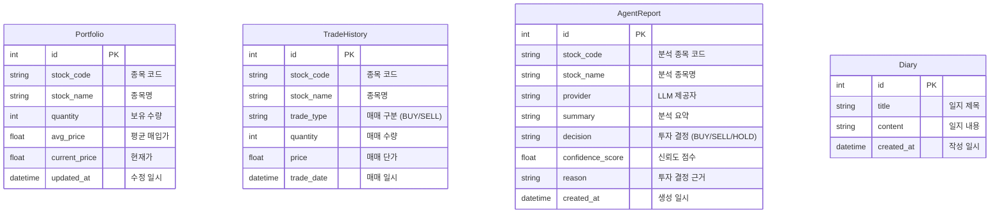

# Fin-Us Backend Database Schema

이 문서는 SQLModel을 사용하여 정의된 SQLite 데이터베이스 스키마를 시각화합니다.

## ER Diagram

## 테이블 설명

- **Portfolio**: 사용자의 현재 주식 잔고 정보를 관리합니다. 한국투자증권(KIS) API 데이터를 기준으로 동기화됩니다.
- **TradeHistory**: 사용자의 매매 이력을 기록합니다.
- **AgentReport**: AI 에이전트가 생성한 종목 분석 결과 및 투자 의견을 저장합니다.
- **Diary**: 사용자의 개인적인 투자 생각이나 일지를 기록합니다.
