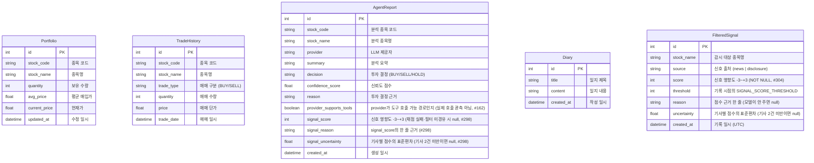

# Fin-Us Backend Database Schema

이 문서는 SQLModel을 사용하여 정의된 SQLite 데이터베이스 스키마를 시각화합니다.

## ER Diagram

## 테이블 설명

- **Portfolio**: 사용자의 현재 주식 잔고 정보를 관리합니다. 한국투자증권(KIS) API 데이터를 기준으로 동기화됩니다.
- **TradeHistory**: 사용자의 매매 이력을 기록합니다.
- **AgentReport**: AI 에이전트가 생성한 종목 분석 결과 및 투자 의견을 저장합니다.
- **Diary**: 사용자의 개인적인 투자 생각이나 일지를 기록합니다.
- **FilteredSignal**: 2차 필터가 채점했지만 임계값(`SIGNAL_SCORE_THRESHOLD`)에 못 미쳐 상세 분석까지 가지 않은 신호를 남깁니다(#304). AgentReport에는 임계값 이상만 남으므로, 임계값을 조정하려면 걸러낸 쪽의 분포가 필요합니다.
  - signal 본문 원문은 저장하지 않습니다 — 보존 비용과 개인정보 범위가 커지는 데 비해 점수 분포 집계에는 필요하지 않습니다.
  - `score`는 NOT NULL입니다. 채점에 실패한 신호는 fail-open으로 통과해 상세 분석까지 가므로 이 테이블에 오지 않고, 본문이 비었거나 직전과 같아 채점을 건너뛴 신호는 기록하지 않습니다.
  - `FILTERED_SIGNAL_RETENTION_DAYS`(기본 30일)가 지난 행은 매일 04:10(KST) `purge_filtered_signals` 잡이 지웁니다.
  - 점수 구간별 건수는 `GET /api/v1/db/filtered-signals/histogram`으로 조회합니다(`source`·`stock_name`·`days` 필터).
